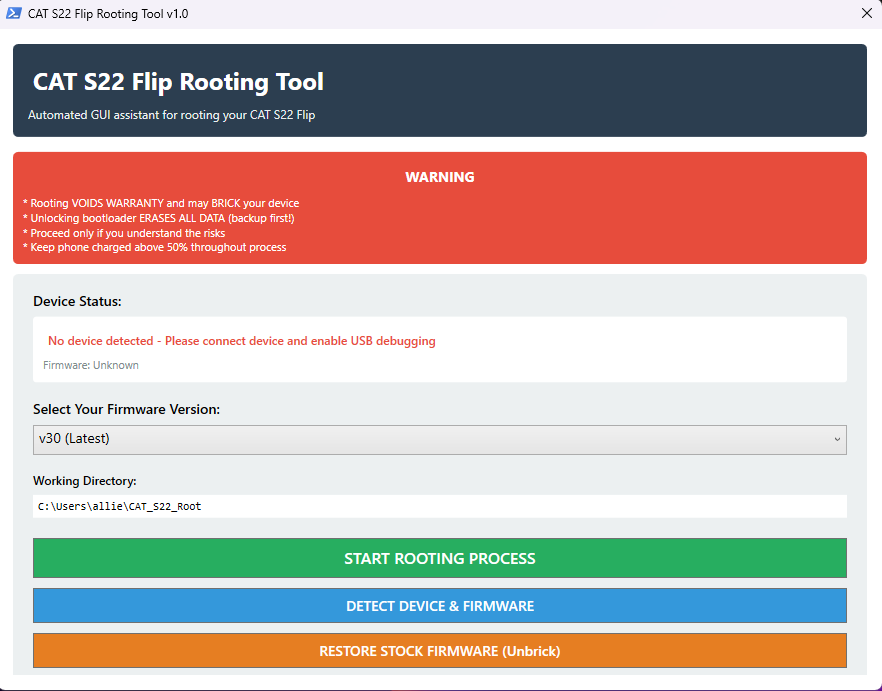
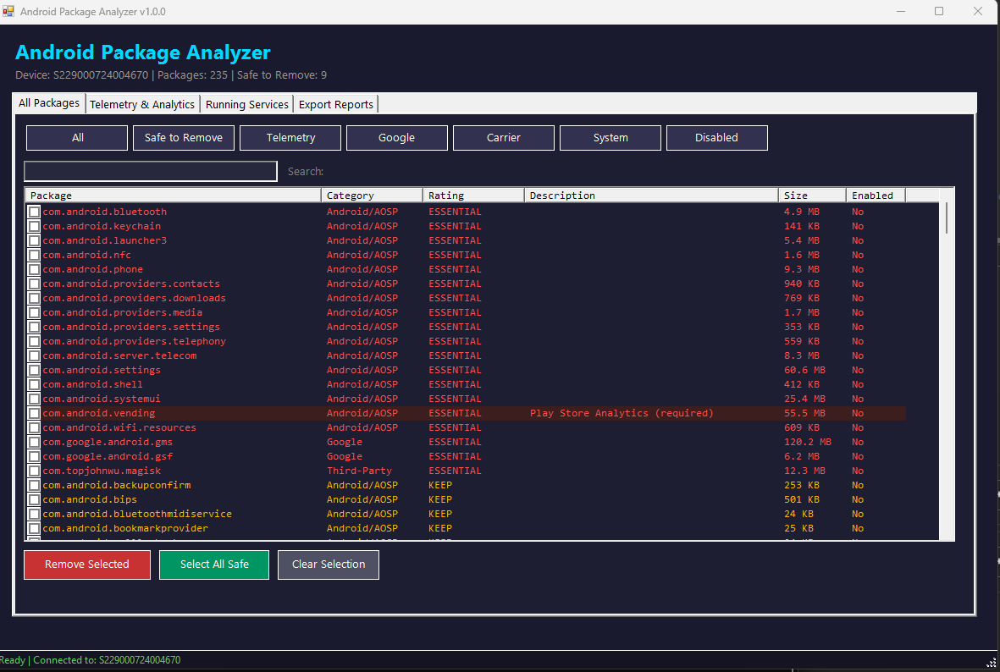
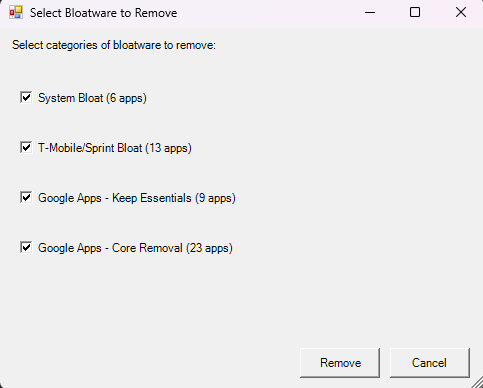
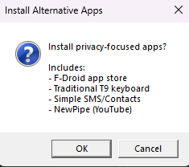
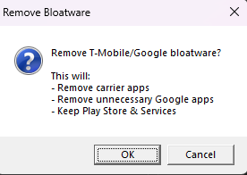

# CAT S22 Flip Root Tool v4.0

> **Development Note:** This tool was developed with assistance from Claude (Anthropic AI) and extensively tested on real CAT S22 hardware. The code has been refined through iterative development and real-world debugging to ensure reliability.

**One-click root tool for CAT S22 Flip (T-Mobile) firmware v30**




## Features

- Automated rooting process
- Unlocks bootloader
- Installs Magisk
- Optional debloat wizard
- Removes T-Mobile/Google bloatware
- Battery optimization
- Full error recovery

## Requirements

- Windows 10/11
- CAT S22 Flip on firmware v30
- USB data cable (not just charging cable)
- ~500MB free disk space
- Phone battery above 50%

---

## Download Options

### Option 1: Portable Executable (Recommended)

**One-click GUI tool - no PowerShell setup required!**

[-blue?style=for-the-badge&logo=windows)](https://github.com/allie-rae-devop/CAT-S22-Root-Tool-Release/releases/latest/download/CAT_S22_Root_Tool_Portable.zip)

**Package Contents:**
| File | Size | Description |
|------|------|-------------|
| `CAT_S22_Root_Tool.exe` | 28 KB | GUI launcher application |
| `CAT_S22_Root_Tool.ps1` | 68 KB | Main rooting script |
| `CAT_S22_Enhanced_Debloat.ps1` | 20 KB | Debloat & app installer |
| `boot_images/boot_v30.img` | 32 MB | Pre-extracted boot image |
| `Magisk-v25.2.apk` | 11 MB | Magisk app |
| `README_EXE.txt` | 9 KB | Quick start guide |

**How to Use:**
1. Download and extract `CAT_S22_Root_Tool_Portable.zip`
2. Right-click `CAT_S22_Root_Tool.exe` → **Run as administrator**
3. Click **"Detect Device"** to verify connection
4. Click **"Root Device"** to start rooting
5. Click **"Debloat Device"** after rooting (optional)
6. Follow on-screen instructions

**Features:**
- Professional GUI with progress tracking
- Real-time log display with color-coded messages
- Auto-downloads Android platform-tools on first run (~15MB one-time)
- No PowerShell execution policy changes required
- Automatic administrator elevation
- Device and firmware version detection

**Perfect for:**
- Users who want the simplest experience
- Users unfamiliar with PowerShell/command line
- Quick setup without configuration
- Avoiding Windows security policy issues

---

### Option 2: PowerShell Scripts (Advanced Users)

**Full control - run scripts directly with full transparency**

[-green?style=for-the-badge&logo=powershell)](https://github.com/allie-rae-devop/CAT-S22-Root-Tool-Release/releases/latest/download/CAT_S22_Root_Tool_Scripts.zip)

**Package Contents:**
| File | Description |
|------|-------------|
| `CAT_S22_Root_Tool.ps1` | Main rooting script with GUI |
| `CAT_S22_Enhanced_Debloat.ps1` | Debloat wizard |
| `boot_images/boot_v30.img` | Pre-extracted boot image |
| `Magisk-v25.2.apk` | Magisk installer |

**Setup:**
```powershell
# Option A: Set execution policy once (recommended)
Set-ExecutionPolicy -ExecutionPolicy RemoteSigned -Scope CurrentUser

# Option B: Bypass for current session only
Set-ExecutionPolicy -Scope Process -ExecutionPolicy Bypass

# Run the tool
.\CAT_S22_Root_Tool.ps1
```

**Why choose scripts:**
- Full transparency - inspect every line of code
- Customize behavior for your needs
- No executable trust required
- Easier to modify for different devices/firmware

---

## Comparison

| Feature | Portable EXE | PowerShell Scripts |
|---------|--------------|-------------------|
| **Ease of use** | One-click | Requires setup |
| **GUI** | Professional interface | Built-in PowerShell GUI |
| **Execution policy** | No issues | May need bypass |
| **Transparency** | Source included | Direct script access |
| **Customization** | Limited | Full control |
| **Best for** | Most users | Advanced users |

**Both methods produce identical results!**

---

## Security & Trust

### Is the EXE safe?

**Yes!** The portable executable is:
- **Open source** - All C# wrapper code is in `src/` folder
- **Reproducible** - Build it yourself using `build.ps1`
- **No telemetry** - Zero data collection, no network calls except platform-tools download
- **Offline-capable** - Works without internet after first run
- **VirusTotal clean** - Scan it yourself

### What's inside the EXE?

The GUI wrapper simply:
1. Extracts bundled files to `%TEMP%\CAT_S22_Root\`
2. Downloads platform-tools from Google (first run only)
3. Runs the PowerShell scripts with `-ExecutionPolicy Bypass`
4. Displays output in a GUI window

**Nothing hidden** - all source code is in the repository!

### Build the EXE yourself

Don't trust pre-built executables? Build it yourself:
```powershell
# Clone the repo
git clone https://github.com/allie-rae-devop/CAT-S22-Root-Tool-Release.git
cd CAT-S22-Root-Tool

# Build the executable
.\build.ps1

# Or with ZIP package
.\build.ps1 -Package

# Output: build/CAT_S22_Root_Tool.exe
```

---

## Quick Start

### Before Running:

1. **Enable Developer Options** on phone:
   - Settings → About phone
   - Tap "Build number" 7 times

2. **Enable USB Debugging**:
   - Settings → Developer options
   - Enable "USB debugging"
   - Enable "OEM unlocking"

3. **Connect phone via USB** and accept the debugging prompt

### Run the Tool:

**Using Portable EXE:**
1. Extract the ZIP file
2. Double-click `CAT_S22_Root_Tool.exe`
3. Click "Detect Device" then "Root Device"

**Using PowerShell Scripts:**
```powershell
Set-ExecutionPolicy -Scope Process -ExecutionPolicy Bypass
.\CAT_S22_Root_Tool.ps1
```

---

## Important Warnings

- **Unlocking bootloader WIPES ALL DATA** - backup everything first!
- Tool requires internet for first-time setup (platform-tools download)
- Process takes ~15-20 minutes
- Phone will reboot multiple times
- Keep phone charged above 50%

---

## Project Structure

```
CAT_S22_Root_Tool/
├── CAT_S22_Root_Tool.ps1           # Main rooting tool (PowerShell GUI)
├── CAT_S22_Enhanced_Debloat.ps1    # Debloat & app installer
├── Analyze-AndroidPackages.ps1     # Package analyzer tool (NEW)
├── boot_images/
│   └── boot_v30.img                # Pre-extracted boot image
├── Magisk-v25.2.apk                # Magisk installer
├── src/                            # EXE source code
│   ├── CAT_S22_Root_Tool_GUI.cs    # C# GUI wrapper
│   └── CAT_S22_Root_Tool_SelfContained.cs
├── build.ps1                       # Build script (PowerShell)
├── build.bat                       # Build script (Batch)
├── build_selfcontained.ps1         # Self-contained build script
├── README.md                       # This file
├── README_EXE.txt                  # EXE quick start guide
└── assets/                         # Screenshots
```

---

## Screenshots

| Root Tool | Debloat Tool |
|-----------|--------------|
|   |  |
|  |  |

---

## Android Package Analyzer (New!)

A comprehensive tool for analyzing and managing all packages on your rooted device.


### Features

- **Complete Package Analysis** - Lists ALL installed packages (system + user)
- **Smart Categorization** - Groups by vendor: Google, T-Mobile, Samsung, AOSP, etc.
- **Safety Ratings** - Color-coded recommendations:
  - **ESSENTIAL** (Red) - Never remove (Play Services, SystemUI, etc.)
  - **KEEP** (Orange) - Important functionality
  - **REVIEW** (Yellow) - Research before removing
  - **SAFE TO REMOVE** (Green) - Known bloatware
- **Telemetry Detection** - Identifies all data collection packages
- **One-Click Disable** - Remove all telemetry with one button
- **Running Services** - View and analyze background processes
- **Export Reports** - HTML, CSV, and JSON backup formats

### How to Use

```powershell
# Set execution policy (if not already done)
Set-ExecutionPolicy -Scope Process -ExecutionPolicy Bypass

# Launch the analyzer with GUI
.\Analyze-AndroidPackages.ps1

# Console mode (no GUI)
.\Analyze-AndroidPackages.ps1 -NoGui

# Export reports only
.\Analyze-AndroidPackages.ps1 -ExportOnly
```

### GUI Tabs

1. **All Packages** - Browse, filter, search, and select packages for removal
2. **Telemetry & Analytics** - Dedicated view of data collection packages (highlighted in red)
3. **Running Services** - Shows active background services with recommendations
4. **Export Reports** - Generate HTML reports, CSV exports, and backup files

### Safety Features

- Prevents removal of ESSENTIAL packages
- Confirms before any removal action
- Creates backup of package list
- Logs all removals with restore commands
- Easy restore if something goes wrong

> **Future Integration:** The Package Analyzer will be integrated into the Portable EXE launcher in a future update. It will appear as an "Analyze Packages" button alongside "Root Device" and "Debloat Device". For now, run the PowerShell script directly. The tool will also be included in both the Portable EXE and Scripts release packages.

---

## Debloat & Alternative Apps

After rooting, the tool offers optional debloating:

### Remove Bloatware

**Safe to Remove:**
- T-Mobile/Sprint apps (all)
- YouTube, YouTube Music
- Google Maps, Photos, Gmail
- Chrome browser
- Facebook services

**KEEP THESE (Essential):**
- Google Play Store
- Google Play Services
- Google Services Framework

### Install Alternative Apps

**Recommended for flip phone:**
- **Traditional T9** - Classic predictive text keyboard
- **F-Droid** - Open-source app store
- **NewPipe** - YouTube without ads
- **Simple SMS/Contacts/Dialer** - Lightweight alternatives
- **K-9 Mail** - Privacy-focused email

---

## Troubleshooting

### "Device not detected"
- Use a USB DATA cable (not just charging)
- Try different USB ports
- Install Google USB drivers
- Accept USB debugging prompt on phone

### "Bootloader unlock failed"
- Ensure OEM unlocking is enabled in Developer Options
- Try manual unlock: `fastboot flashing unlock`

### Windows Defender flags the EXE
- False positive - common for PowerShell-based tools
- Scan at VirusTotal to verify
- Use Option 2 (scripts) if concerned

### "Execution policy" error
```powershell
Set-ExecutionPolicy -Scope Process -ExecutionPolicy Bypass
```

---

## Verify Root

```powershell
adb shell su -c "id"
# Should show: uid=0(root)
```

Or open Magisk app - should show "Installed"

---

## FAQ

**Q: Which download should I choose?**
A: Most users should use the **Portable EXE**. Use scripts if you want full control or don't trust executables.

**Q: Does the EXE phone home?**
A: No. The only network request is downloading platform-tools from Google on first run.

**Q: Can I use it offline?**
A: After first run, yes! Platform-tools are cached locally.

**Q: Will this work on firmware v29?**
A: The tool is optimized for v30. For v29, the boot image may differ.

**Q: Can I undo rooting?**
A: Yes, flash stock firmware or use Magisk's uninstall feature.

---

## Contributing

Found a bug? Have a suggestion?
- Open an issue on GitHub
- Submit a pull request
- Share on XDA Forums

---

## Credits

- Magisk by topjohnwu
- imgpatchtools by erfanoabdi
- XDA CAT S22 community
  - xda member iksw for methodology
  - xda member jcul for downgrade method and OTA files
- Original rooting guide contributors

---

## Disclaimer

- **Rooting voids your warranty**
- **Unlocking bootloader erases all data**
- Author not responsible for bricked devices
- Inspect scripts before running if concerned
- Always backup important data first

---

## License

MIT License - See LICENSE file

---

**Version:** 4.0
**Last Updated:** January 2025
**Tested On:** CAT S22 Flip (T-Mobile) firmware v30
